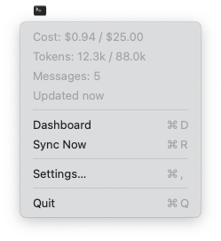
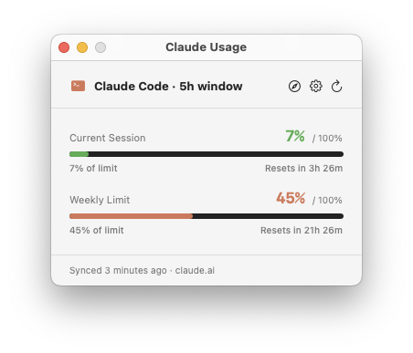
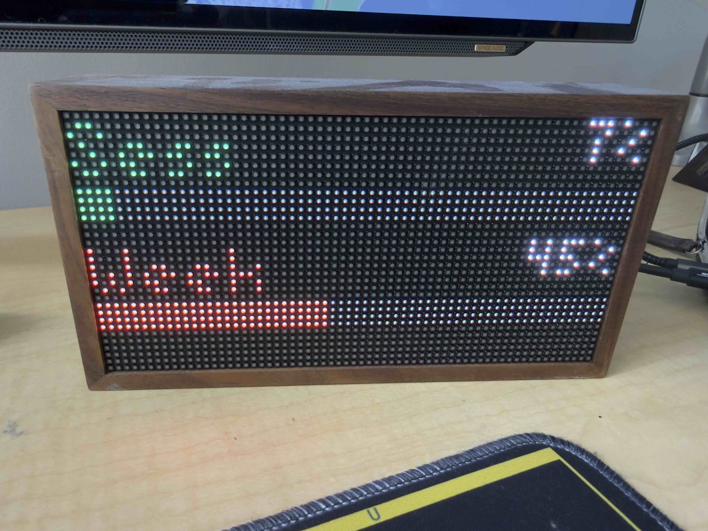

# Claudius

A macOS menu bar app that tracks your [Claude Code](https://docs.anthropic.com/en/docs/claude-code) usage in real time with optional [Tidbyt](https://tidbyt.com) display integration.

#### Menu Bar


#### Dashboard


#### Tidbyt


## Features

- **Live usage from claude.ai** — fetches your real utilization percentages directly from claude.ai's internal API (session key required)
- **Menu bar at a glance** — current session usage percentage displayed right in your menu bar
- **Dashboard window** — 5-hour session and 7-day weekly utilization with progress bars and reset countdowns
- **Local fallback** — reads Claude Code's JSONL session logs from `~/.claude/projects/` when web integration isn't configured
- **Plan presets** — select Claude Pro, Max 5x, or Max 20x to auto-set limits
- **Tidbyt integration** — push a live usage display to your Tidbyt LED device (optional)
- **Background sync** — refreshes every 60 seconds automatically

## Requirements

- **macOS 15+** (Sequoia)
- **Claude Code** installed and used at least once (so session logs exist) — only needed for local fallback mode
- **Tidbyt device + [Pixlet CLI](https://github.com/tidbyt/pixlet)** — only needed if you want the Tidbyt display; the app works fine without it

## Installation

### Build from source

```bash
git clone https://github.com/nsluke/Claudius.git
cd Claudius
open Claudius.xcodeproj
```

Build and run in Xcode (Cmd+R). The app will appear in your menu bar.

> **Note:** You'll need to set your own development team in Xcode under Signing & Capabilities before building.

### Download

Grab the `.dmg` from the [Releases](https://github.com/nsluke/Claudius/releases) page, open it, and drag Claudius to your Applications folder.

> **Gatekeeper note:** Since the app is not notarized, macOS will block it on first launch. Right-click (or Control-click) the app and choose **Open**, then click **Open** in the dialog. You only need to do this once.

## Setup

### Web integration (recommended)

For the most accurate usage data, connect Claudius directly to your claude.ai account:

1. **Launch Claudius** and open **Settings** (gear icon or menu bar > Settings)
2. **Get your credentials** from claude.ai:
   - Open [claude.ai/settings/usage](https://claude.ai/settings/usage) in your browser
   - Open DevTools (**Cmd+Option+I**) → **Application** → **Cookies** → **claude.ai**
   - Copy the value of `sessionKey` and `lastActiveOrg`
3. **Paste them** into the Session Key and Organization ID fields in Claudius Settings
4. **Pick your subscription plan** (Pro, Max 5x, Max 20x, or Manual)
5. **Save** — Claudius will start polling claude.ai every 60 seconds

### Local mode (no setup needed)

Without web credentials, Claudius automatically reads Claude Code's local JSONL session logs from `~/.claude/projects/`. This provides estimated token counts and cost but is less accurate than the web integration.

### Tidbyt (optional)

1. Install [Pixlet CLI](https://github.com/tidbyt/pixlet): `brew install tidbyt/homebrew-tidbyt/pixlet`
2. Enter your Tidbyt API token and Device ID in Settings
3. Choose a layout (Default, Minimal, or Graph)

## How It Works

### Web mode

Claudius calls `claude.ai/api/organizations/{orgId}/usage` using your session cookie. This returns the same utilization percentages shown on the claude.ai settings page — a 5-hour session window and a 7-day weekly window, each as a percentage of your plan limit.

### Local mode

Claudius reads the JSONL session logs that Claude Code writes to `~/.claude/projects/`. For each assistant message within the active 5-hour block, it extracts token usage (`input_tokens + output_tokens`) and deduplicates streaming entries using `message.id + requestId`. Cost is estimated using Anthropic's published per-token rates.

## Tidbyt Display

If you own a [Tidbyt](https://tidbyt.com), Claudius can push a live usage widget. In web mode it shows session and weekly utilization bars; in local mode it shows cost and token progress bars. Both turn red when you're over 90% of your limit.

Three layouts are available: **Default** (dual progress bars), **Minimal** (text only), and **Graph** (vertical bar chart).

## Project Structure

```
Claudius/
├── ClaudiusApp.swift            # App entry point, menu bar scene, AppState manager
├── ClaudeWebUsageService.swift  # claude.ai API integration
├── UsageView.swift              # Dashboard window with metrics and progress bars
├── SettingsView.swift           # Settings UI, plan selection, credentials
├── TidbytManager.swift          # JSONL log parsing, cost calculation, Pixlet integration
├── KeychainHelper.swift         # Secure storage for session key and Tidbyt token
├── UsageStats.swift             # Data model for usage stats
├── claude_usage.star            # Tidbyt default layout (dual progress bars)
├── claude_minimal.star          # Tidbyt minimal layout (text only)
├── claude_graph.star            # Tidbyt graph layout (vertical bars)
└── Assets.xcassets/             # App icon and colors
```

## Contributing

Contributions welcome! Open an issue or submit a pull request.

## License

[MIT](LICENSE)
