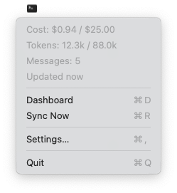
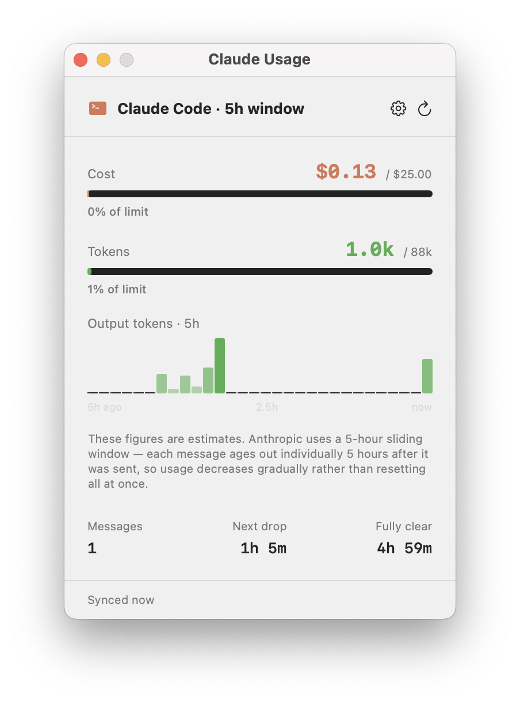
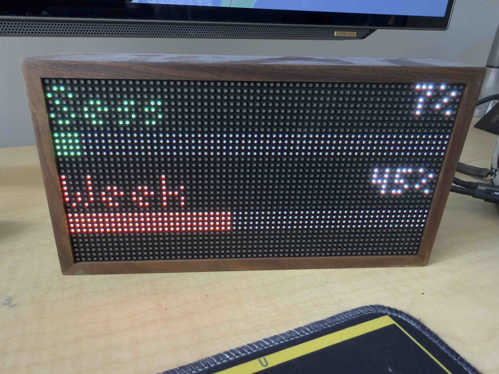

# Claudius

A macOS menu bar app that shows your [Claude Code](https://docs.anthropic.com/en/docs/claude-code) usage in real time.

Claudius reads Claude Code's OAuth token straight from your macOS Keychain, so it works the moment you launch it. It shows the same utilization percentages you'd see on claude.ai — session, weekly, and any per-model cap such as Fable — right in your menu bar. Optionally, it can push a live display to a [Tidbyt](https://tidbyt.com) LED device.

> **Prerequisite:** You must have [Claude Code](https://docs.anthropic.com/en/docs/claude-code) installed and logged in (`claude` in your terminal). Claudius depends on the OAuth token that Claude Code stores in your macOS Keychain — without it, usage tracking will fall back to local log estimates.

| Menu Bar | Dashboard | Tidbyt |
|----------|-----------|--------|
|  |  |  |

## How It Works

Claudius finds the OAuth token that Claude Code stores in your macOS Keychain (service `Claude Code-credentials`) and calls the Anthropic OAuth usage API every 5 minutes. The API returns your usage as percentages of your plan limit — the same numbers shown on the claude.ai settings page.

Claudius renders **whatever windows the API reports**, rather than a fixed pair. Today that's typically your 5-hour session window, your 7-day weekly window, and — on accounts that have one — a separate weekly cap that applies to a single model, such as Fable. If Anthropic adds, renames, or removes a window, Claudius picks up the change without an update: unrecognized windows are labelled with the name the API gives them, and windows that disappear simply stop rendering.

If the token is missing or expired, Claudius falls back to reading Claude Code's local JSONL session logs from `~/.claude/projects/` and estimating usage from raw token counts.

### Keychain access

Claudius treats the Claude Code login token (`Claude Code-credentials`) as **read-only** — Claude Code owns and refreshes that item, so Claudius never writes to it. Rewriting it would reset the item's access-control list and race Claude Code's own refreshes, which is what caused the repeating "Always Allow" prompt.

Claudius reads that item once to bootstrap, then keeps its own copy of the credentials in a Claudius-owned Keychain item and refreshes that copy independently. Reading its own item never prompts, so routine polls and app restarts touch the Keychain silently. Claude Code's item is only consulted again if Claudius's stored refresh token stops working (for example after you re-log-in to Claude Code). If you deny the prompt, Claudius backs off — it won't ask again until you click **Sync Now** or relaunch the app.

macOS ties the one-time "Always Allow" grant to the app's designated requirement (its code signature). For that grant to persist across updates, release builds must be signed with a stable Developer ID — a fixed Team ID and bundle identifier — so the designated requirement doesn't change from one build to the next. Unsigned or ad-hoc builds get a new identity each time and will re-prompt.

## Features

- **Zero-config auth** — automatically reads Claude Code's OAuth token from your Keychain; no session keys or org IDs to copy
- **Customizable menu bar** — show every reported usage window as bars, numbers, both, or a single session percentage
- **Model-scoped caps** — surfaces a per-model weekly limit (e.g. Fable) automatically when your account reports one
- **Dashboard window** — one progress bar and reset countdown per usage window
- **Local fallback** — estimates usage from Claude Code's JSONL logs when OAuth isn't available
- **Plan presets** — select Claude Pro, Max 5x, or Max 20x to set your limits
- **Tidbyt integration** — push a live usage display to your Tidbyt LED device (optional)
- **Background sync** — refreshes every 5 minutes

## Requirements

- **macOS 15+** (Sequoia)
- **[Claude Code](https://docs.anthropic.com/en/docs/claude-code)** installed and logged in — run `claude` in your terminal and sign in to your claude.ai account so the OAuth token is stored in your Keychain
- **Tidbyt device + [Pixlet CLI](https://github.com/tidbyt/pixlet)** — only needed for the Tidbyt display

## Installation

### Download

Grab the `.dmg` from the [Releases](https://github.com/nsluke/Claudius/releases) page, open it, and drag Claudius to your Applications folder.

> Releases are signed with a Developer ID and notarized by Apple, so the app opens normally on first launch.

### Build from source

```bash
git clone https://github.com/nsluke/Claudius.git
cd Claudius
open Claudius.xcodeproj
```

Build and run in Xcode (Cmd+R). The app appears in your menu bar.

> You'll need to set your development team in Xcode under Signing & Capabilities before building.

## Setup

### Usage tracking (automatic)

1. Install [Claude Code](https://docs.anthropic.com/en/docs/claude-code) and log in to your claude.ai account
2. Launch Claudius — it finds the OAuth token automatically
3. Pick your subscription plan in Settings (Pro, Max 5x, or Max 20x)

That's it. No browser DevTools, no cookies, no org IDs.

### Tidbyt (optional)

1. Install [Pixlet CLI](https://github.com/tidbyt/pixlet): `brew install tidbyt/homebrew-tidbyt/pixlet`
2. Enter your Tidbyt API token and Device ID in Settings
3. Choose a layout: Default (dual progress bars), Minimal (text only), or Graph (vertical bar chart)

## Project Structure

```
Claudius/
├── ClaudiusApp.swift            # App entry point, menu bar scene, AppState manager
├── ClaudeWebUsageService.swift  # Anthropic OAuth API transport + diagnostics
├── UsageBucket.swift            # Usage-window model and tolerant response decoding
├── KeychainHelper.swift         # Keychain access for Claude Code OAuth token and Tidbyt credentials
├── UsageView.swift              # Dashboard window with metrics and progress bars
├── SettingsView.swift           # Settings UI, plan selection, Tidbyt config
├── TidbytManager.swift          # JSONL log parsing, cost calculation, Pixlet integration
├── UsageStats.swift             # Data model for usage stats
├── claude_usage.star            # Tidbyt default layout (dual progress bars)
├── claude_minimal.star          # Tidbyt minimal layout (text only)
├── claude_graph.star            # Tidbyt graph layout (vertical bars)
└── Assets.xcassets/             # App icon and colors
```

## Contributing

Contributions welcome! Open an issue or submit a pull request.

## License

[MIT](LICENSE)
